## DCS F-14

### Essential Reading

[F-14 NATOPS Manual](<https://info.publicintelligence.net/F14AAD-1.pdf> )

[Heatblur DCS F-14 Tomcat Manual](<http://www.heatblur.se/F-14Manual/> )

### Basic Aircraft Operation

This section covers basic aircraft operation - the bare necessity needed to get a player into the F-14 Tomcat in the air and some degree of weapons employment.

#### Fast Cold Startup

Fast Startup Sequence from Jabbers.

1. Turn on Oxygen (switch on left of seat)

2. Turn on Ground Power `\` `F8` `F2` `F1`

3. Turn on Ground Air Supply `\` `F8` `F5` `F1`

4. Tell Jester to startup: Bring up Jester Menu and select "Startup" (3)

5. Jester will initiate a Comms check: Bring up the Jester Menu and select "Loud and Clear" (4) 

6. Arm Ejection Seat (flip the lever above the seat)

7. Close the Canopy `LCtrl` + `c` , or let Jester do it instead

8. Set engine crank to "right" (switch on the left below the Inlet Ramp switches)
   1. Wait till Engine RPM reaches the second bottom line on the RPM gauge
   2. Set the right throttle detent to "Idle" - Right Click the right throttle
   3. Once the right engine is started, disconnect the ground power:  `\` `F8` `F2` `F2`

9. Set engine crank to "left" (same switch as step 8)

   1. Wait till Engine RPM reaches the second bottom line on the RPM gauge
   2. Set the left throttle detent to "Idle" - Left Click the right throttle
   3. As the left engine starts, Jester will begin to flick switches, use this as the cue to proceed

10. Turn on the Stability Augmentation System (SAS) - flick the following 3 switches into the upright position:

    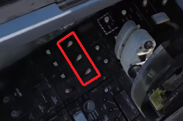

11. Turn on the ARA-63 (the RWR) by flicking the power switch up on the ARA panel (right side):

    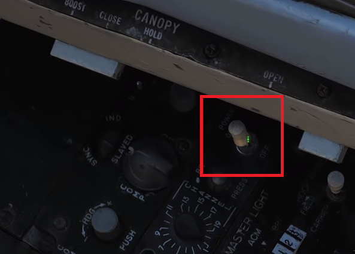

12. On the right side Display Panel, turn on the VDI, HUD and HSD displays (located under the power section of the display switch panel)

13. Open up the Jester menu to check if he is ready to do INS alignment. If there are no INS options, just wait for a while. If Jester is ready to conduct INS alignment, the radial menu will look like this:

    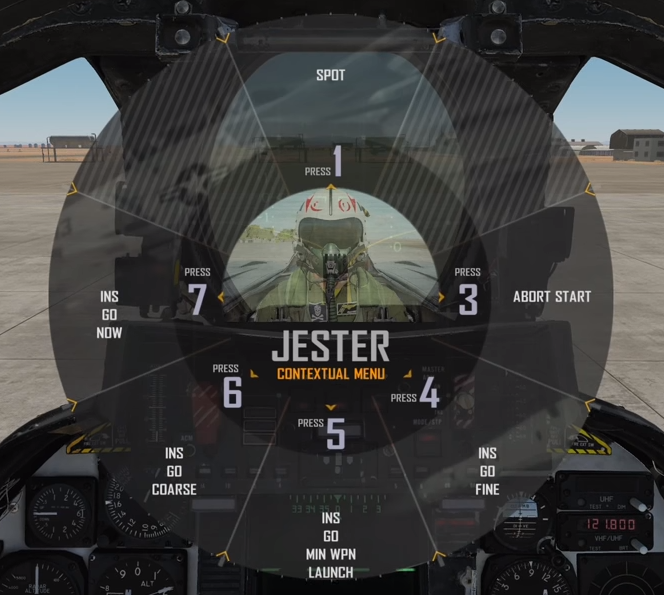

    There are 4 options for INS alignment:

    - INS Go Now: Fastest alignment but least accurate 
    - INS Go Coarse: Slightly more accurate but not sufficient for weapons employment
    - INS Min Wpn Launch: Minimum INS alignment necessary for weapons employment
    - INS Go Fine: Most accurate INS alignment available but takes the most time (approximately 8 minutes)

    Pick the most suitable alignment and let Jester take care of the rest.

14. Check and ensure that all trims are set to 0. The trim panel can be found left of the landing gear handle.

15. Erect the Stand-by ADI (front right panel)

    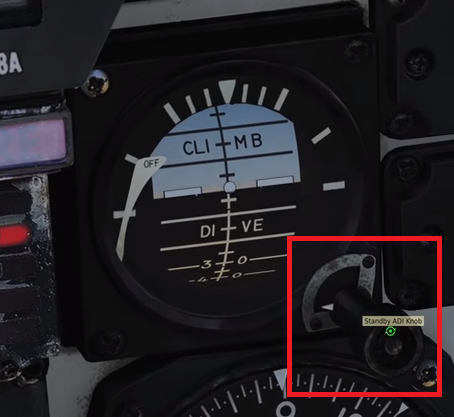

16. Uncage the Radar Altimeter (front left panel):

    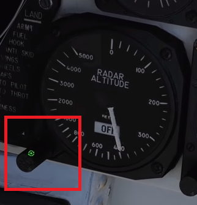

17. Push the emergency wing sweep all the way forward (handle is located on the left of the seat beside the throttle):

    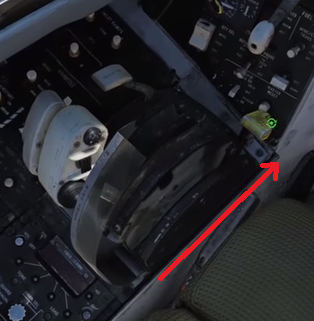

    Once the lever is fully forward, right click it to push it in and lock it in place. Then close the cover.

18. On the annunciator panel (right side), the "wing sweep" and "ladder" lights should still be illuminated.

    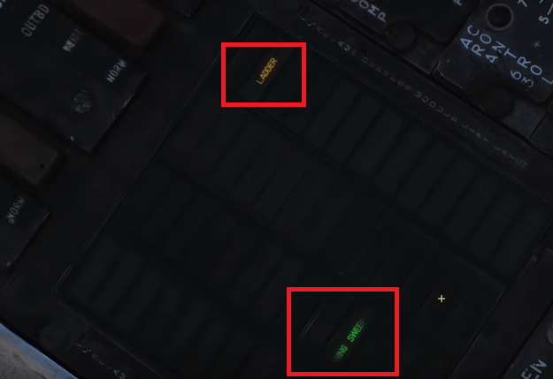

19. To turn off the wing sweep light, press the "Master Reset" button located in front of the wing sweep lever. Then check that the light is turned off.

20. To turn off the ladder light, disconnect ground air supply:  `\` `F8` `F5` `F2`. Then check that the light turns off.

21. It is likely that Jester has not completed INS alignment. Take the time to adjust the cockpit settings to comfort. It is also possible to turn on the lights by clicking the switches under the position pane (to the left of the annunciator panel). If necessary, turn on and configure the radio.

22. Release the parking brake (the handle is yellow/black to the left of the landing gear handle). Check the state of the brakes from the light to the left of the front cockpit glass.

23. Engage Nosewheel steering in preparation for taxi-ing to the runway.

24. Slowly taxi to the runway. 

25. At any time, the Radar Altimeter might beep to announce that is on - do not be alarmed.

#### Taking Off

1. Line up to the runway.
2. Turn off Nose Wheel Steering - check that the front light "NWS ENGA" is off.
3. Make sure that the wing sweep configuration is set to "Auto"
4. The wing sweep should be 20 degrees before takeoff
5. Engage the flaps
6. Throttle up to Full or Mil Power
7. At 135 knots, slowly pull back on the stick
8. Once a positive vertical rate is achieved, bring up the landing gear `g` and flaps.

### Tactical Air Navigation (TACAN)

Credits to the [Grim Reapers](<https://www.youtube.com/watch?v=_SHlzJrpP2U> ).

#### Introduction

Tactical Air Navigation, also known as TACAN, allows the aircraft to navigate to anywhere that has a TACAN station (such as at an airbase, carrier or refueling tanker). The F-14's TACAN unit is the ARN-84. It works in the 5mHz radio band and has a maximum range of 300 nm if line of sight permits it (terrain and curvature of the Earth will affect the TACAN range).

Unlike a radio station, TACANs station work by channel numbers. These numbers are either given in mission briefs or visible in the mission editor:

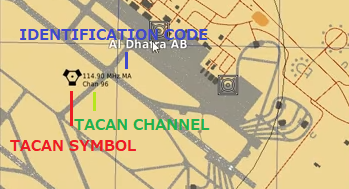

The triangle symbol is the universal symbology for a TACAN station. The TACAN channel for that station can be found under "Chan". TACAN stations can end with an "X" or "Y" suffix. If a suffix is not present, an "X" is assumed. The identification code (or rather, callsign of the station) in this case is "MA" or "Mike Alpha". This will be used to confirm that the correct TACAN station has been selected during a flight.

When creating a mission, it is important to note that aircraft carriers do not have their TACAN transmitters turned on by default. The TACAN transmitter can be turned on in mission editor under the "ADVANCED (WAYPOINT ACTIONS)" menu. The Type will be "Perform Command" and the Action will be "Activate TACAN":

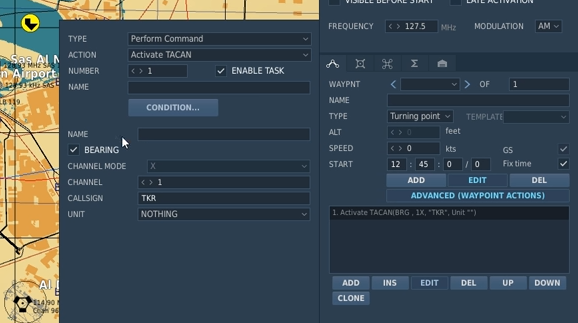

#### TACAN Panel

The TACAN panel is located on the left side console for the both the Pilot and RIO. Ensure that the TACAN CMD switch is set to the correct setting (PLT for pilot and NFO for RIO), this is because only one crewmember is allowed to be in control of the aircraft TACAN at any point of time:

The TACAN control panel allows the user to dial in the correct TACAN channel (using the channel selector), the channel type (X or Y) using the appropriate switch and then select a mode using the mode knob. 

To select the channel, turn the top dial (with the arm) to change the bottommost number and the dial on the side to change the two numbers on top (mentioning this because it proved counterintuitive the first time round). In the above case from the introduction, the user would dial (096) for the channel 96.

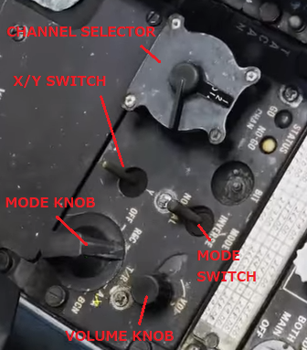

As of writing, the mode switch does not support INVERSE mode. It also recommended that the TACAN audio be set high.

The ARN-84 supports the following modes (selectable by the Mode Knob):

- OFF - Turns off TACAN
- REC - Receive Only: Passive TACAN mode that returns azimuth reading to the TACAN station only
- T/R - Transmit and Receive: Active TACAN mode that returns both azimuth and range (also known as SLANT) to the TACAN station
- A/A - Air to air TACAN mode: T/R mode but for air to air refueling, returns both azimuth and range to the refueling tanker
- BCN - Beacon TACAN mode (not functional at time of writing)

#### TACAN and Cockpit Symbology

Upon connecting to a TACAN station, various displays within the cockpit will update with azimuth (and if applicable, range) information to the TACAN station accordingly. The first of which is the Bearing Distance Heading Indicator (BDHI):

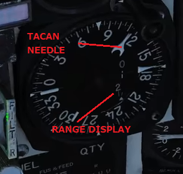

The TACAN needle (larger needle) will provide the azimuth and the range display will update accordingly. The range display reads in the clockwise direction - in this case, the range is "012" or 12 miles away. *Do not confuse the TACAN needle with the smaller UHF/ADF needle*

The Horizontal Situation Display Indicator (HSD) should also update with the TACAN azimuth:

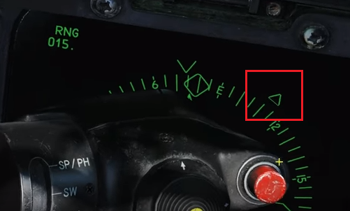

If the volume knob was set high enough, the TACAN station's identification code (callsign) will be sounded to the aircraft in morse code. In the case of the introduction, the identification code would be "MA" or "Mike Alpha" which converts to "-- .-" in morse. Upon hearing this series of beeps, the crew can confirm if the correct TACAN station has been connected to. After verification, the volume knob can be turned back down if desired.

### Aircraft Maneuvering and Flight Characteristics

The F-14 is an analog aircraft with many unique characteristics. This has caused it to develop a reputation for being a temperamental and at times even dangerous aircraft. Flying the F-14 however, can be fairly simple if the pilot is aware of some basic rules and the various quirk the airframe possesses. If it helps, the F-14 should be approached with a clean slate - experience in the DCS F/A-18 Hornet, F-15 or other aircraft should not be assumed to be transferrable. That might set the right expectation with regards to controlling the aircraft. 

#### Roll and Pitch Authority

The first thing you would notice in the F-14 is that at higher degrees of wing sweep, there is a corresponding loss of pitch authority and gain in roll authority. This means that at high speed (and correspondingly, high degree of wing sweep), the aircraft is very easy to get into a roll, but it becomes hard to capitalize on the roll as the aircraft pitch maneuverability is compromised. This is an inherent aspect of the swept wing feature and is something to keep in mind before getting into a turning fight. Generally, it is advisable to utilize the F-14 as an interceptor and not a dogfighter. 

#### Adverse and Proverse Yaw

When rolling the F-14 at normal AoA ranges, one might assume that it suffers from a slight case of adverse yaw. Adverse yaw is when the aircraft has a natural and undesirable tendency to yaw in the opposite direction of a roll. However, this is not the case. If one were to check the axis of the roll - in 3rd person mode for instance, it becomes obvious that the axis of roll goes through the upper part of the front cockpit glass and not through the nose.

With this new reference in mind, one would begin to realize that the F-14 actually exhibits proverse yaw - a natural and undesirable tendency to yaw in the direction direction of a roll. This behavior gets more exaggerated as the AoA increases. This means that rudder input in the opposite direction of the roll is required to do a proper turn (also known as coordinated turn).

As 12-13 units of AoA, the F-14 begins to exhibit adverse yaw instead of proverse yaw. Rudder input must now be applied in the direction of the roll to maintain a coordinated turn.

Coordinated turns are important as it allows the pilot to maintain boresight alignment with with the plane of the turn that the aircraft is undergoing. This allows the aircraft to maintain a stable firing solution through a maneuver in a dogfight.

#### Wing Rocking

The F-14 is an analog aircraft, which means that there is often no correction for oscillations caused during maneuvering. One cause for such oscillations is wing rocking - which occurs at around 22-24 units of AoA with roll or rudder inputs. This causes the wings to rock left and right which might make it hard to obtain a firing solution during a dogfight. Unfortunately, there is no easy way around this. There are 3 ways to reduce this effect:

- Decrease AoA to below the 22-24 AoA region
- Lose sufficient speed for the effect to abate
- Counter the wing rocking with rudder input (which also results in a loss of speed)

Wing rocking is a highly undesirably behavior in a turning fight as it makes it difficult to keep a bogey within a firing solution. Given this consideration, turning the F-14 at high AoA should be minimized - this can be achieved by planning ahead and using the F-14 in the capacity of an interceptor as it was designed.

#### Buffeting

The F-14 utilizes vortex lift to maintain stability in flight - these vortices will inevitably contact the tail at increasing levels of AoA, resulting in buffeting. Knowing the effect of the buffeting by heart can allow a competent pilot to judge their AoA quickly even without referring to the AoA indicator.

#### Optimal Climb, Cruise and Descent Rates

According to the F-14 NATOPs BINGO calculation/planner, the following are the advised climb, cruise and descent rates:

- Climb: M0.7 (high drag) - M0.75 (clean), using full MIL power
- Cruise: M0.72 (Angels 40), M0.6 (Angels 30), M0.55 (Angels 20)
- Descent: 200KIAS (high drag), 210KIAS (clean), using throttle idle

#### Inertial Navigation System (INS)

INS refers to your Inertial Navigation System. Without it, there will be drift in the aircraft heading readings which adds up greatly over time. this can be as minute as a few meters upon takeoff to tens of miles after a long flight.

INS alignment is the process of waiting for the INS computer to detect the rotation of the Earth - the longer the wait, the more data is collected and the better the INS correction will be. In the F-14, it is almost always recommended to use "INS go fine", "INS Min Weapon Launch" is acceptable when pressed for time. "INS Go Coarse" should only be reserved for short practice flights and "INS Go Now" should almost never be used as there is almost no alignment being conducted (unless possibly in GAW and the player is attempting to scramble rapidly). 

If the player is in Single-player, it is possible to speed up up INS alignment using `RCtrl` + `z`. Return to normal time using `RShift` + `z`. 

When creating a mission, it is possible to store a heading alignment. Under the options tab for the aircraft (in the same pane to set waypoints) there is an option for "Stored Heading Alignment". If this is selected, the INS alignment for that aircraft will take slightly less than 2 minutes for a fine alignment. Take note that this does not work for a Carrier-based takeoff.

If unsure if the INS alignment is progressing, switch the VDI to TID repeater mode and look for the progress symbology at the top of the display. If it is progressing to the right, alignment is proceeding accordingly - the player just has to wait for it.