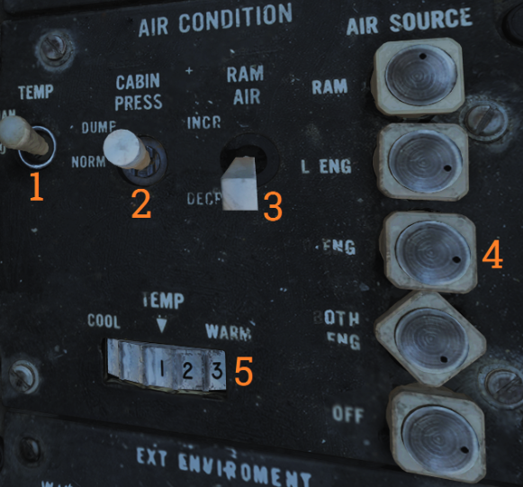
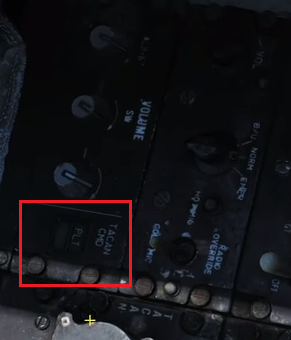

## DCS F-14

Just a basic compilation of information for the DCS F-14B. Primarily made for the pilot, but I may look into the RIO position in the future.

### Essential Reading

[F-14 NATOPS Manual](<https://info.publicintelligence.net/F14AAD-1.pdf> )

[Heatblur DCS F-14 Tomcat Manual](<http://www.heatblur.se/F-14Manual/> )

##### Urgent To-Dos

- Ground Landing Guide
- Air to Air Weapons Employment
- Case I Carrier Takeoff
- Case I Carrier Recovery
- Bingo Fuel Calculation

### Basic Aircraft Operation

This section covers basic aircraft operation - the bare necessity needed to get a player into the F-14 Tomcat in the air and some degree of weapons employment.

#### Fast Cold Startup

Fast Startup Sequence from Jabbers.

1. Turn on Oxygen (switch on left of seat)

2. Turn on Ground Power `\` `F8` `F2` `F1`

3. Turn on Ground Air Supply `\` `F8` `F5` `F1`

4. Tell Jester to startup: Bring up Jester Menu and select "Startup" (3)

5. Jester will initiate a Comms check: Bring up the Jester Menu and select "Loud and Clear" (4) 

6. Arm Ejection Seat (flip the lever above the seat)

7. Close the Canopy `LCtrl` + `c` , or let Jester do it instead

8. Set engine crank to "right" (switch on the left below the Inlet Ramp switches)
   1. Wait till Engine RPM reaches the second bottom line on the RPM gauge
   2. Set the right throttle detent to "Idle" - Right Click the right throttle
   3. Once the right engine is started, disconnect the ground power:  `\` `F8` `F2` `F2`

9. Set engine crank to "left" (same switch as step 8)

   1. Wait till Engine RPM reaches the second bottom line on the RPM gauge
   2. Set the left throttle detent to "Idle" - Left Click the right throttle
   3. As the left engine starts, Jester will begin to flick switches, use this as the cue to proceed

10. Turn on the Stability Augmentation System (SAS) - flick the following 3 switches into the upright position:

    

11. Turn on the ARA-63 (the RWR) by flicking the power switch up on the ARA panel (right side):

    

12. On the right side Display Panel, turn on the VDI, HUD and HSD displays (located under the power section of the display switch panel)

13. Open up the Jester menu to check if he is ready to do INS alignment. If there are no INS options, just wait for a while. If Jester is ready to conduct INS alignment, the radial menu will look like this:

    

    There are 4 options for INS alignment:

    - INS Go Now: Fastest alignment but least accurate 
    - INS Go Coarse: Slightly more accurate but not sufficient for weapons employment
    - INS Min Wpn Launch: Minimum INS alignment necessary for weapons employment
    - INS Go Fine: Most accurate INS alignment available but takes the most time (approximately 8 minutes)

    Pick the most suitable alignment and let Jester take care of the rest.

14. Check and ensure that all trims are set to 0. The trim panel can be found left of the landing gear handle.

15. Erect the Stand-by ADI (front right panel)

    

16. Uncage the Radar Altimeter (front left panel):

    

17. Push the emergency wing sweep all the way forward (handle is located on the left of the seat beside the throttle):

    

    Once the lever is fully forward, right click it to push it in and lock it in place. Then close the cover.

18. On the annunciator panel (right side), the "wing sweep" and "ladder" lights should still be illuminated.

    

19. To turn off the wing sweep light, press the "Master Reset" button located in front of the wing sweep lever. Then check that the light is turned off.

20. To turn off the ladder light, disconnect ground air supply:  `\` `F8` `F5` `F2`. Then check that the light turns off.

21. It is likely that Jester has not completed INS alignment. Take the time to adjust the cockpit settings to comfort. It is also possible to turn on the lights by clicking the switches under the position pane (to the left of the annunciator panel). If necessary, turn on and configure the radio.

22. Release the parking brake (the handle is yellow/black to the left of the landing gear handle). Check the state of the brakes from the light to the left of the front cockpit glass.

23. Engage Nosewheel steering in preparation for taxi-ing to the runway.

24. Slowly taxi to the runway. 

25. At any time, the Radar Altimeter might beep to announce that is on - do not be alarmed.

#### Taking Off

1. Line up to the runway.
2. Turn off Nose Wheel Steering - check that the front light "NWS ENGA" is off.
3. Make sure that the wing sweep configuration is set to "Auto"
4. The wing sweep should be 20 degrees before takeoff
5. Engage the flaps
6. Throttle up to Full or Mil Power
7. At 135 knots, slowly pull back on the stick
8. Once a positive vertical rate is achieved, bring up the landing gear `g` and flaps.

### Cold Start

This is the cold start procedure as outlined in the [Heatblur F-14 Episode 3: Cold and Dark (Full Startup)](https://www.youtube.com/watch?v=ws1GxPG2ZXw) video. The procedures for start up on the F-14 Manual differ slightly and can be accessed in the following links:

- Pre-startup: [Interior Inspection](http://www.heatblur.se/F-14Manual/procedures.html#interior-inspection)
- [Pre-Start](http://www.heatblur.se/F-14Manual/procedures.html#prestart)
- [Engine Start](http://www.heatblur.se/F-14Manual/procedures.html#engine-start)
- [Post Start](http://www.heatblur.se/F-14Manual/procedures.html#poststart)

1. Turn on Oxygen (switch on left of seat)

   

2. Connect Ground Power `\` `F8` `F2` `F1`

3. Connect Ground Air Supply `\` `F8` `F5` `F1`

4. Tell Jester to startup: Bring up Jester Menu and select "Startup" (3)

5. Jester will initiate a Comms check: Bring up the Jester Menu and select "Loud and Clear" (4) 

6. Jester will inform the pilot to check that the landing gear is extended and that the transition light is off

   - Check that the landing gear handle is down:

   

   - Transition light is position 4 in the image. It indicates if the landing gear is in transition to the state set by the landing gear. It should be off to confirm that the landing gear is fully deployed and functioning.

7. Jester will then ask the pilot to select 'LTS' on the master test switch (located on the right console). LTS mode is to test the cockpit indication lights - verify that all lights illuminate.

   

   `RMB` to pull out or push in the Master Test switch

   `LMB` to turn the Master Test switch.

   Check around the cockpit and ensure that all lights are functional.

8. The next test is the Fire Detection System test. Switch the Master Test switch to 'FIRE DET/EXT' - it should be the next switch position after 'LTS'. 

   - Check that the green 'GO' light on the Test Panel is illuminated. If the test is bad, the red 'NO GO' light will be illuminated instead.
   - Check that the left and right Fire Lights on the center panel are illuminated.

   

9. The next test is the Instruments test, set the Master Test switch to 'INST' - once again this should be the next test in line after the 'FIRE DET/EXT' test. Once the switch is pushed in, take note if the following changes are observed on the corresponding cockpit instrumentation:

   - Fuel Panel should display a fuel quantity of 2000 lbs
   - Wing Sweep Indicator should display 45 degrees of sweep
   - AoA Indicator will display 17 units of AoA
   - Engine Panel 'OFF' display will disappear 
     - RPM: 96%
   - Oxygen Level: 2L
   - L and R FUEL FLOW lights illuminated

10. Disengage the Master Test switch by pulling it out

11. Arm the ejection seat above using the lever above the Pilot's seat

12. Jester will now close the canopy (or the pilot can opt to do it using `LCtrl` + `c` )

13. On the ACM panel (front, right below the HUD), check the following:

    - **GUN RATE:** LOW
    - **SW COOL:** OFF
    - **MSL PREP:** OFF
    - **MSL MODE**: NORM

14. Check that the Emergency Stores Jettison button light is not illuminated (position 6 in the image below).

    

15. Under the AIR CONDITION panel, check that the AIR SOURCE is set to OFF (incorrect in this picture):

    

16. Further below the AIR CONDITION panel is the Hydraulic Transfer Pump panel. Lift the cap and set the switch to 'SHUTOFF'.

    

17. Return to the MASTER TEST Panel, on the right is the Emergency Flight Hydraulic switch. Uncap and switch to 'LOW'

    - Check that Hydraulic Pressure Indicator (to the left of the engine RPM indicator) has the LOW indicator display an 'ON' flag

      

    - Do the same for the 'HIGH' setting

    - Finally, switch the EMERG FLT HYD switch to 'AUTO' and cap the switch to complete the test

18. Start the Right Engine:

    1. Set the crank switch to the right position and wait for RPM to reach 20%

    2. Bring the right throttle to 'IDLE' to introduce fuel into the engine

    3. Wait for the engine RPM to reach 50% and the engine crank switch to return to center automatically

    4. On the Advisory Indicator, check that the 'R GEN' and 'R FUEL PRESS' caution lights are off

       

    5. Check that the engine parameters are within normal parameters:

       - **RPM:** 62-78%
       - **TIT:** approx 500
       - **Fuel flow:** 915-1400

19. Disconnect the Ground Power:  `\` `F8` `F2` `F2`

    - Take note that the Ground Chief's reply will not be audible as the canopy has been shut

20. Check that the hydraulic transfer pump works and that there is bi-directional flow between flight hydraulics and the combined hydraulics

    1. Switch Engine Crank Switch to left
    2. Check the Hydraulic Pressure Indicator for the combined hydraulic pressure and wait for it to reach around 3000
    3. Switch Engine Crank Switch to the center
    4. Wait for a while and check that the pump pressure remains constant
    5. Switch the HYD TRANSFER PUMP switch to 'NORMAL' and (this switch is from step 16)
    6. Check again that the combined hydraulic pressure holds at around 3000
    7. Switch the HYD TRANSFER PUMP switch back to 'SHUTOFF'

21. Repeat Step 18 for the Left Engine

22. Disconnect ground air supply:  `\` `F8` `F5` `F2`. 

    - Once again, the reply will not be audible

23. If the pilot is not currently a Jester-assisted startup, command Jester to do an INS alignment. By default, the alignment for a Jester-assisted startup is a fine alignment. Check step 13 of the Fast Startup section of the guide on how to request an INS alignment from Jester.

24. Under the AIR CONDITION panel, cycle the AIR SOURCE through 'R ENG', 'L ENG' and 'BOTH ENG'

25. Switch the HYD TRANSFER PUMP switch to 'NORMAL' and close the cap

26. Set the Stability Augmentation Switches to 'ON'

    - Also check that the warning lights for stability augmentations are switched off in the advisory panel (top row)

27. Set each engine to secondary mode and check the advisory panel for the warning (the switches for ENG MODE SELECT are above the AFCS panel from the previous check). Then set the switch back to the original position after verifying the test. Do this for each engine individually.

28. At the UHF Panel (right of the AFCS Panel), set the Mode seletor knob (left) to 'GUARD' and the function selector knob (right) to MAIN/BOTH/ADF, whichever is required. Verify that the frequency/channel display is operational.

    

29. In the TACAN control panel, set the TACAN mode knob to 'T/R'

30. On the ARA-63 Control Panel (right console), set the power to 'ON'

    

31. Turn on power to the following displays and verify that they are on:

    - VDI
    - HUD
    - HSD

    Also check the UHF and VHF remote indicators are turned on - turn the knobs to increase the brightness if necessary.

    

32. Uncage the radar altimeter (turn clockwise). Increasing clockwise raises the altitude warning level.

33. Check that the trims are working and then zero all trims. The trim panel is to the left of the landing gear.

34. Uncage the Standby Attitude Indicator

35. Check integrated trim system:

    - Deploy the airbrake partially and close them, the trim should move slightly
    - Deploy the airbrakes fully and observe that the trim changes again
    - Retract the airbrakes when integrated trim is verified to be working

36. Check the refueling probe, extend and retract to verify functionality (the switch is located below the landing gear handle)

37. Push the emergency wing-sweep handle to full forward and push it in

38. Press the master reset switch (in front of the wing sweep handle) and put the wings into 'AUTO' (this button is on the joystick for the F-14, so bind it accordingly)

39. Turn on the external lights on the Master Light Control Panel (right of the AIR CONDITION panel)

    - For detailed information on the light panel, visit the [Master Light Control Panel](<http://www.heatblur.se/F-14Manual/cockpit.html?highlight=transition%20light#master-light-control-panel>) page on the Heatblur F-14 manual

40. Check the flaps and slats (the lever is to the left of the throttle)

    - Move the flaps lever to 50%

    - Visually check that the slats are down

    - Check the flaps in the wheels-flap position indicator

      

    - Move the flaps lever to 100% 

    - Visually check that the slats are down

    - Check the flaps in the wheels-flap position indicator

41. Check all control surfaces with the flight stick and rudder

42. Check Direct Lift Control mode

    - Toggle the DLC (the control is located on the joystick)
    - Check the spoiler positions in the trim panel
    - Verify the spoiler positions visually

43. Set the ANTI SKID SPOILER BK switch to 'SPOILER BK' this is the anti skid mode that uses the spoiler brake only.

    - Visually check that the spoilers are up

44. Check the spoilers and throttle

    - Ensure that the parking brake is on
    - Add a little bit of throttle
    - Check that the spoiler brakes go all the way down - visually and on the trim panel
    - Release the throttle and check that the spoiler brakes come back up
    - Set the ANTI SKID SPOILER BK switch to 'OFF'

45. Retract the flaps and slats

46. Set the maneuvering flaps to down (using the DLC on the flight stick) - check the flaps indicator.

47. Set wing-sweep to 50 degrees using manual mode

48. Retract the maneuvering flaps until they are just slightly 'cracked'

49. Set wing-sweep mode to 'BOMB' - verify that the maneuvering flaps fully retract

50. Set the emergency wing-sweep handle to 68 degrees and check that this is complete both in the wing-sweep indicator and visually

51. Oversweep the wing-sweep handle beyond 68 degrees:

    - Check that the 'HZ TAIL AUTH' (horizontal tail authorization) light goes out on the advisory panel
    - Check the wing-sweep indicator for the 'OVER' flag

52. Set wing-sweep mode to auto (on the joystick) and press the master reset button
53. Depress the radar altimeter knob to start the Built in Test (BIT)
    - Display should show 100 feet and the indicator green light illuminates
    - Release the knob and the indicator should show 0 feet
    - Warning should sound in the cockpit and the ALT LOW should illuminate
54. Check that the displays are set as needed
55. Run TACAN BIT
    - Press the BIT button on the TACAN panel
    - Both the 'GO' and 'NO GO' lights should illuminate
56. Run ARA-63 BIT, this is the ILS test
    - On the Display Panel:
      - Set HUD AWL switch to 'ILS'
      - Set the VDI AWL switch to 'ILS'
      - Set the MODE to 'LDG' (landing)
      - Set the STEER CMD to 'AWL/PCD'
    - Press and hold the BIT button on the ARA-63 panel
      - Observe that there is a sweep on both the HUD and VDI
      - Once done, release the BIT button
    - Reset the displays
      - Set HUD AWL switch to 'ACL'
      - Set VDI AWL switch to 'ACL'
      - Set MODE to 'T.O'
      - Set STEER CMD to 'DEST'
57. Set altimeter reference pressure level and reset mode
    - The altimeter reference pressure level should be provided in the mission brief or the airfield in mission editor
    - Press and hold the Mode switch in the 'RESET' position to reset the altimeter based on the reference pressure level
58. Compass Check
    - Compare compass IMU heading to that on the HUD, VDI, HSD and BDHI
    - The compass is actually behind the right Windshield frame - this means that it can be very difficult for players without track IR to actually see the compass in normal views. Under such circumstances, the compass check can be ignored for gameplay reasons (if the HUD, VDI, HSD and BDHI seem to line up)
59. Check Flight Instruments - do a general once over through the whole cockpit to ensure everything seems in order
60. The plane is now ready to Taxi

#### Postlanding Procedure

The following is the postlanding checklist from NATOPS F14AAD-1, Section 7.4.18. Conduct this procedure after aircraft has reached the parking spot and is ready to shutdown.

1. Set the Speed brake switch to 'RET' (this is located on the throttle)
2. Set the ANTI SKID SPOILER BK switch to 'OFF'
3. Set the Flaps and slats to 'UP'
   - Move the flap handle fully up and check for compete retraction of main flaps and slats as well as auxiliary flaps
     - Flap indicator: 0%
     - FLAP Caution Light: Off
   - Check for automatic deactivation of outboard spoiler module.
     - As soon as the auxiliary flaps are retracted (8 seconds), the wings will sweep aft if commanded
4. Set wing-sweep mode to 'BOMB' (after the 8 seconds)
5. Set the emergency wing-sweep handle to 55 degrees and verify that the wings move to the position
6. Set the emergency wing sweep handle to over sweep (OV SW / OV SWP):
   - Move the handle to 68 degrees and hold
   - Wait for HZ TAIL AUTH caution light to go out and the 'OVER' flag appears on the wing sweep indicator
   - Move the handle to full aft (75 degrees) and stow
7. Turn off all avionics
   - Data Link
   - Radar Altimeter
   - Displays
   - TACAN
   - ARA-63
   - Do not turn off the UHF/VHF radio
8. Verify and record all codes on the DCP (FAIL, FLT, IBIT)
9. Set the right throttle to 'OFF'
   - Run both engines for 5 minutes at 'IDLE' before shutdown
   - Take care not to set the left throttle to 'OFF' by accident
10. Set the OBOGS master switch to 'OFF' (alert the RIO)
11. Turn the OXYGEN SUPPLY valve to 'OFF'
12. Do a bi-directional hydraulic transfer check
    - Set the HYD TRANSFER PUMP switch to 'NORMAL'
    - Check the hydraulic pressure readings are equalized even with the right engine turned off
    - Set the HYD TRANSFER PUMP switch to 'SHUTOFF'
13. Set ejection seat to 'SAFE'
14. Disarm Ordnance (not applicable to DCS)
15. Wheels should be chocked (not applicable to DCS)
16. Pull the parking brake
    - Do not pull the parking brake subsequent to a field landing if the brakes have been used extensively
17. Set the UHF / VHF RADIO MODE switch to 'OFF'
18. Cage the standby attitude gyro
19. Set the Left throttle to 'OFF' (alert the RIO)
20. Set EMERG generator switch to 'OFF' (this switch is located on the Master Generator Control Panel)
21. Verify that the EJECT CMD indicator is off (it will look like red an white stripes)
22. The canopy can now be open
23. Aircraft has completed postlanding 

### Cockpit Layout

##### Pilot Layout

Take note of the pilot cockpit layout so as to understand the references made within this guide. It also helps when trying to instruct of advise other players or crews in various situations.

1. Left Side Console
2. Left Vertical Console
3. Left Knee Panel
4. Left Instrument Panel
5. Left Windshield Frame
6. Center Panel
7. Right Windshield Frame
8. Right Instrument Panel
9. Right Knee Panel
10. Right Vertical Console
11. Right Side Console
12. Canopy Control Handle

### Tactical Air Navigation (TACAN)

Credits to the [Grim Reapers](<https://www.youtube.com/watch?v=_SHlzJrpP2U> ).

#### Introduction

Tactical Air Navigation, also known as TACAN, allows the aircraft to navigate to anywhere that has a TACAN station (such as at an airbase, carrier or refueling tanker). The F-14's TACAN unit is the ARN-84. It works in the 5mHz radio band and has a maximum range of 300 nm if line of sight permits it (terrain and curvature of the Earth will affect the TACAN range).

Unlike a radio station, TACANs station work by channel numbers. These numbers are either given in mission briefs or visible in the mission editor:

The triangle symbol is the universal symbology for a TACAN station. The TACAN channel for that station can be found under "Chan". TACAN stations can end with an "X" or "Y" suffix. If a suffix is not present, an "X" is assumed. The identification code (or rather, callsign of the station) in this case is "MA" or "Mike Alpha". This will be used to confirm that the correct TACAN station has been selected during a flight.

When creating a mission, it is important to note that aircraft carriers do not have their TACAN transmitters turned on by default. The TACAN transmitter can be turned on in mission editor under the "ADVANCED (WAYPOINT ACTIONS)" menu. The Type will be "Perform Command" and the Action will be "Activate TACAN":

#### TACAN Panel

The TACAN panel is located on the left side console for the both the Pilot and RIO. Ensure that the TACAN CMD switch is set to the correct setting (PLT for pilot and NFO for RIO), this is because only one crewmember is allowed to be in control of the aircraft TACAN at any point of time:

The TACAN control panel allows the user to dial in the correct TACAN channel (using the channel selector), the channel type (X or Y) using the appropriate switch and then select a mode using the mode knob. 

To select the channel, turn the top dial (with the arm) to change the bottommost number and the dial on the side to change the two numbers on top (mentioning this because it proved counterintuitive the first time round). In the above case from the introduction, the user would dial (096) for the channel 96.

As of writing, the mode switch does not support INVERSE mode. It also recommended that the TACAN audio be set high.

The ARN-84 supports the following modes (selectable by the Mode Knob):

- OFF - Turns off TACAN
- REC - Receive Only: Passive TACAN mode that returns azimuth reading to the TACAN station only
- T/R - Transmit and Receive: Active TACAN mode that returns both azimuth and range (also known as SLANT) to the TACAN station
- A/A - Air to air TACAN mode: T/R mode but for air to air refueling, returns both azimuth and range to the refueling tanker
- BCN - Beacon TACAN mode (not functional at time of writing)

#### TACAN and Cockpit Symbology

Upon connecting to a TACAN station, various displays within the cockpit will update with azimuth (and if applicable, range) information to the TACAN station accordingly. The first of which is the Bearing Distance Heading Indicator (BDHI):

The TACAN needle (larger needle) will provide the azimuth and the range display will update accordingly. The range display reads in the clockwise direction - in this case, the range is "012" or 12 miles away. *Do not confuse the TACAN needle with the smaller UHF/ADF needle*

The Horizontal Situation Display Indicator (HSD) should also update with the TACAN azimuth:

If the volume knob was set high enough, the TACAN station's identification code (callsign) will be sounded to the aircraft in morse code. In the case of the introduction, the identification code would be "MA" or "Mike Alpha" which converts to "-- .-" in morse. Upon hearing this series of beeps, the crew can confirm if the correct TACAN station has been connected to. After verification, the volume knob can be turned back down if desired.

### Aircraft Maneuvering and Flight Characteristics

The F-14 is an analog aircraft with many unique characteristics. This has caused it to develop a reputation for being a temperamental and at times even dangerous aircraft. Flying the F-14 however, can be fairly simple if the pilot is aware of some basic rules and the various quirk the airframe possesses. If it helps, the F-14 should be approached with a clean slate - experience in the DCS F/A-18 Hornet, F-15 or other aircraft should not be assumed to be transferrable. That might set the right expectation with regards to controlling the aircraft. 

#### Roll and Pitch Authority

The first thing you would notice in the F-14 is that at higher degrees of wing sweep, there is a corresponding loss of pitch authority and gain in roll authority. This means that at high speed (and correspondingly, high degree of wing sweep), the aircraft is very easy to get into a roll, but it becomes hard to capitalize on the roll as the aircraft pitch maneuverability is compromised. This is an inherent aspect of the swept wing feature and is something to keep in mind before getting into a turning fight. Generally, it is advisable to utilize the F-14 as an interceptor and not a dogfighter. 

#### Adverse and Proverse Yaw

When rolling the F-14 at normal AoA ranges, one might assume that it suffers from a slight case of adverse yaw. Adverse yaw is when the aircraft has a natural and undesirable tendency to yaw in the opposite direction of a roll. However, this is not the case. If one were to check the axis of the roll - in 3rd person mode for instance, it becomes obvious that the axis of roll goes through the upper part of the front cockpit glass and not through the nose.

With this new reference in mind, one would begin to realize that the F-14 actually exhibits proverse yaw - a natural and undesirable tendency to yaw in the direction direction of a roll. This behavior gets more exaggerated as the AoA increases. This means that rudder input in the opposite direction of the roll is required to do a proper turn (also known as coordinated turn).

As 12-13 units of AoA, the F-14 begins to exhibit adverse yaw instead of proverse yaw. Rudder input must now be applied in the direction of the roll to maintain a coordinated turn.

Coordinated turns are important as it allows the pilot to maintain boresight alignment with with the plane of the turn that the aircraft is undergoing. This allows the aircraft to maintain a stable firing solution through a maneuver in a dogfight.

#### Wing Rocking

The F-14 is an analog aircraft, which means that there is often no correction for oscillations caused during maneuvering. One cause for such oscillations is wing rocking - which occurs at around 22-24 units of AoA with roll or rudder inputs. This causes the wings to rock left and right which might make it hard to obtain a firing solution during a dogfight. Unfortunately, there is no easy way around this. There are 3 ways to reduce this effect:

- Decrease AoA to below the 22-24 AoA region
- Lose sufficient speed for the effect to abate
- Counter the wing rocking with rudder input (which also results in a loss of speed)

Wing rocking is a highly undesirably behavior in a turning fight as it makes it difficult to keep a bogey within a firing solution. Given this consideration, turning the F-14 at high AoA should be minimized - this can be achieved by planning ahead and using the F-14 in the capacity of an interceptor as it was designed.

#### Buffeting

The F-14 utilizes vortex lift to maintain stability in flight - these vortices will inevitably contact the tail at increasing levels of AoA, resulting in buffeting. Knowing the effect of the buffeting by heart can allow a competent pilot to judge their AoA quickly even without referring to the AoA indicator.

#### Optimal Climb, Cruise and Descent Rates

According to the F-14 NATOPs BINGO calculation/planner, the following are the advised climb, cruise and descent rates:

- Climb: M0.7 (high drag) - M0.75 (clean), using full MIL power
- Cruise: M0.72 (Angels 40), M0.6 (Angels 30), M0.55 (Angels 20)
- Descent: 200KIAS (high drag), 210KIAS (clean), using throttle idle

#### Inertial Navigation System (INS)

INS refers to your Inertial Navigation System. Without it, there will be drift in the aircraft heading readings which adds up greatly over time. this can be as minute as a few meters upon takeoff to tens of miles after a long flight.

INS alignment is the process of waiting for the INS computer to detect the rotation of the Earth - the longer the wait, the more data is collected and the better the INS correction will be. In the F-14, it is almost always recommended to use "INS go fine", "INS Min Weapon Launch" is acceptable when pressed for time. "INS Go Coarse" should only be reserved for short practice flights and "INS Go Now" should almost never be used as there is almost no alignment being conducted (unless possibly in GAW and the player is attempting to scramble rapidly). 

If the player is in Single-player, it is possible to speed up up INS alignment using `RCtrl` + `z`. Return to normal time using `RShift` + `z`. 

When creating a mission, it is possible to store a heading alignment. Under the options tab for the aircraft (in the same pane to set waypoints) there is an option for "Stored Heading Alignment". If this is selected, the INS alignment for that aircraft will take slightly less than 2 minutes for a fine alignment. Take note that this does not work for a Carrier-based takeoff.

If unsure if the INS alignment is progressing, switch the VDI to TID repeater mode and look for the progress symbology at the top of the display. If it is progressing to the right, alignment is proceeding accordingly - the player just has to wait for it.